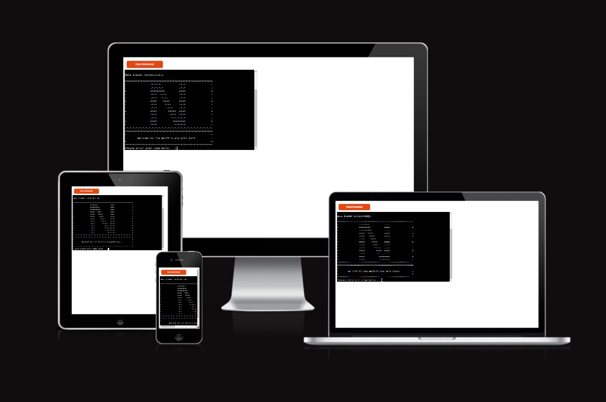

# ***The Netflix analysis tool***
[Public Heroku application here](https://milestone3-mattm.herokuapp.com/)

[Google sheet with data used for analysis here](https://docs.google.com/spreadsheets/d/17R_6HWEAwSK1co3U75EFtQCfpvsylo-q3HqG1_y9ALw/edit#gid=0)

[image from Am I Responsive](https://ui.dev/amiresponsive?url=https://milestone3-mattm.herokuapp.com/)

## ***Project Overview***
The Netflix analysis tool is s terminal-based application, written in python that allows for data collected on Netflix users through the pandemic to be manipulated and shown in graph form in the terminal using the [Plotext](https://pypi.org/project/plotext/) library.

## ***Table of Contents***
1. ### [User Experience(UX)](User)
    * Strategy
        * Project Goals
        * User stories
    * Scope
    * Design
    * Skeleton
        * Wireframes 
        * Logic Flowchart
2. ### Features
    * Current features
    * Future features
3. ### Technology used
4. ### Testing
    * User stories
    * Input validation
    * Known issues & Fixes
5.  ### Deployment
6. ### Credits
7. ### Acknowledgments

## ***User Experience (UX)***
### ***Strategy*** -  *Project Goals*
This project aimed to develop a terminal-based python application to demonstrate my ability to make use of the CLI. Python is a very good language for this, as it is primarily used in backend system design. It has a wide range of libraries available to pull from, which were instrumental in the completion of this project.

I chose to build the application with a focus on data analysis. I pulled the dataset from [Kaggle](https://www.kaggle.com/datasets/prasertk/netflix-daily-top-10-in-us) who in turn got it from [The Numbers](https://www.the-numbers.com/netflix-top-10). 
The dataset has over 7000 rows of data and 10 columns, arranging the different rankings, viewership-score and titles by date, showing a top ten daily rank for each day of the pandemic. There are multiple ways to analyze and present the data, but I chose to focus on the daily rankings.

### ***Strategy*** -  *User stories*
* *User goals*
    * I want to extract data from an external google sheet
    * I want to be presented with an easy-to-use CLI that clearly explains the steps required to view the data
    * I want to visualize the data in the worksheet and plot it in the terminal
    * I want to calculate the average rank of each show for the pandemic and sort them by the highest to the lowest rank.
    * I want to view the top ten rankings for specific days throughout the pandemic.

* *Site owner goals*
    * I want to provide an application that allows the user to select how and what data they view
    * I want to provide the number of unique titles to the user.
    * I want to maintain the correct order of titles and rankings when calculating the average for the course of the entire pandemic.

### ***Scope***
To achieve the goals laid out in my strategy, I want to implement the following functionality:
* A method of importing data from google sheets.
* A method of keeping the credentials needs to access the sheet in the proper scope so as not to expose them to the main.
* A method of calculating the average score of each title in the full list of titles in the dataset.
* A method of calculating the unique program titles, and the number of unique titles shown in the Netflix top ten throughout the pandemic.
* A method to get valid input from the user to interact with the program.
* A method to graph and visualize the data in the terminal where the project is being hosted. 

### ***Design*** 
The design for this project was minimal, the template given to use by the codeinstitute was pre-built and made use of the standard windows black and white terminal and CLI hosted virtually on Heroku.

### ***Design - Wireframes*** 
No wireframes were required for this project as the frontend was pre-built.

### ***Design - Logic Flowchart***
[flow-chart PDF](assets/pdfs/milestone_3_flowchart.pdf)

The logic flowchart for this project is shown below. The idea was to create a cyclical process that would allow the user to make a single request to load the data from the sheet, make a request to view the data, then loop over that request if they required more information. At the end of the flow, the user is prompted with a clean exit to the program

I designed this flowchart using [Lucidchart](https://lucid.app/users/login#/login?referredProduct=lucidchart)

![[flow-chart image]](assets/images/flow-chart.jpg)

## ***Features***
### ***Main*** 
The main function is quite compact and makes references to some key functions used by the application, as well as two core classes: The GoogleSheet class and the DataManager class.
I will cover the use of the functions first as some of them are referenced within the larger classes.
### ***print_load_animation(delay)***
This is purely a cosmetic function, there to add a positive experience for the user. The program calculations are fast enough that a loading screen is not required, but the length of the load time can be toggled up or down by passing a long or shorter delay to the function as an argument.
### ***remove_duplicates(arr)***
This function takes a list as an argument and returns that same list with the unique items retained and the copies discarded. It does not alter the order in which the unique objects appear in the original array. 
### ***print_welcome_graphic()*** 
This is another function purely for cosmetic reasons. It prints a welcome message and an "N" made to look like the Netflix logo out of stars. 
### ***greet_user()***
This function greets the user, explaining how the program works as well as taking input from the user for a username. It provides input handling, ensuring that only alphabetical characters are entered and that the username is no more than 15 characters long. It returns the username to the main to use later.
### ***get_user_input(choices, in_development)*** 
This function is called multiple times throughout the application, taking input from the user in integer form and handling invalid inputs until the input conditions have been satisfied. I modified this function with an "in_development" argument, that modifies the message printed when the program starts. This highlights to the user which features are currently unavailable and prints a different error message when the user attempts to select one of these unavailable features. Overall, I believe that this will improve UX. The function returns an integer value to be used with related selectors when processing the user's data request.
### ***find_average_rank(titles, data, decimal)*** 
The find average rank function takes two lists as an argument and an integer decimal to set the level of accuracy for the rounding. The function calls the remove_duplicates function to generate a list of unique program titles. An empty 2D list of lists is created of the same length as the unique titles list.  This is so that as the full titles list is iterated upon to capture the individual rankings per day of the programs, the title on each row references its corresponding index in the unique titles list and appends its score on that day to the same index list within the average ranks list. At the end of the function, the values in each list are summed and divided by the length of the list of rankings to achieve the average ranking for each program for the duration of the pandemic. The function returns a list containing both the average rankings and the unique titles, matched together by their index in order of occurrence.  
### ***sort_titles_and_rank(ranked_titles)***
The sort titles and rank function makes use of the "bubble-sort" algorithm for sorting through the list of rankings, arranging them in order of rank and swapping their corresponding title as well. The function is passed a 2D list of unique titles and rankings and returns another 2D list of the same values, sorted in ascending order. 

### ***Class - GoogleSheet*** 
The GoogleSheet class (written in camelcase as is standard practice when writing classes in python) manages the connection to and extraction of the data from the google spreadsheet holding our netflix_data worksheet.

#### ***Methods - \__init__(self)***
The init method is native to every class in python and allows for the class object to be instantiated with the required values:
* self.data = None
* self.sheet = None
* self.scope = [required google authentication links]
* self.creds = Credentials.from_service_account_file('creds.json)
* self.scoped_creds = self.creds.with_scopes(self.scopes)
* self.gspread_client = gspread.authorize(self.scoped_creds)
#### ***Methods - load_data(self)***
Once these fields are instantiated, we invoke load_data on the object to attempt to open a connection with the netflix_data spreadsheet through our gspread client. Any errors opening the sheet or populating the data from the sheet are handled with a try, catch loop that raises a Value Error with exit code 1. Once the connection is established, the data is called from the sheet and the user is notified that a connection is underway.
#### ***Methods - get_data(self)***
This method checks to see if there is any data to display by querying the self.data property. Otherwise, if data is present, the function just returns this property, passing it to the main function.

### ***Class - DataManagaer***
The data manager class handles all of the data associated with the google spreadsheet that we are analyzing. It is the larger of the two classes and is where most of the core logic behind the application is carried out.
#### ***Methods - \__init__(self, sheet)***
The DataManager object is initialized after the google sheets object as it pulls some of its core properties from that class:
* self.worksheet = sheet
* self.column_titles = sheet.row_values(COLUMN_TITLES)
* self.program_titles_column = sheet.col_values(PROGRAM_TITLES)
* self.as_of = sheet.col_values(1)[1:]

The sheet variable is passed to the data_manager object as an argument. 
The next three properties are all related to the row and column values from various data groups contained within the netflix_data spreadsheet. Their variable names state explicitly what they refer to.
#### ***Methods - get_selection(self)***
This method invokes the get_user_input() function and is the main message seen by the user after the greeting screen. It presents the list of data options available to the user and which ones are currently unavailable. Right now, the only feature available is to filter the data based on daily ranking, but this will be looked at further in the future features section.
#### ***Methods - display_data(self, option)***
The display data method is the largest and most complex method in this application and is where the bulk of the heavy lifting is done when it comes to logical processing. The role of this method is to assess the user's chosen data that they wish to view and to apply filters to it if needed before presenting it in the most logical form.

The method uses if-else logic to query the data option passed to it as an argument. It uses the integer option passed to it to access a selector string from the self.column_titles property. This selector is then used to choose the proper logic flow to process the data. As only rank is available right now, this is the one we will be focusing on.  

The method checks using the user option passed to it to see if it is equal to the string 'Rank'. As this string is fixed in the google sheet we know that it isn't changing. It then calls the get_user_input() function again, this time asking if the user would like to see overall data for the program rankings or data on a specific day. It repeats the same logic filtering down again and either calculating the average ranking for the overall data and sorting them, or getting more user input to build a date string. For both options, the user is then asked if they would like to view the data in reverse, calling the get_user_input() function to validate this. 

If the user has chosen to view overall data, they will then be presented with a large, horizontal bar chart in the terminal showing the ranking of each program in order of popularity, with 1 being the highest and 10 being the lowest.

For data on a specific day, we know that it has already been ordered in a list from one to ten and so does not need to be sorted. We can simply extract the column data at the row on which the same index for the date string can be found by slicing the columns for both the title and rankings at that index and 9 subsequent indices.

The data can then be shown in reverse if needed and a much smaller, spaced-out bar chart that can be read in a single terminal screen will be plotted using the plotext library. 

### ***Main - Contd.***
Finally, to finish, both instances of data_manager and sheet are instatiated. The welcome graphic and message are printed on the screen and the user enters their name. The program enters a while loop that loops after the data has been displayed, asking the user if they would like to see more data. 

If the user selects yes, the program begins again, this time with both classes already instantiated as the connection to the sheet has already been made and the data has not been changed since it was originally loaded in.

If the user selects no, they are greeted by a funny message and the program says goodbye to them, citing their name from the previous instance when the username was returned to the main function.